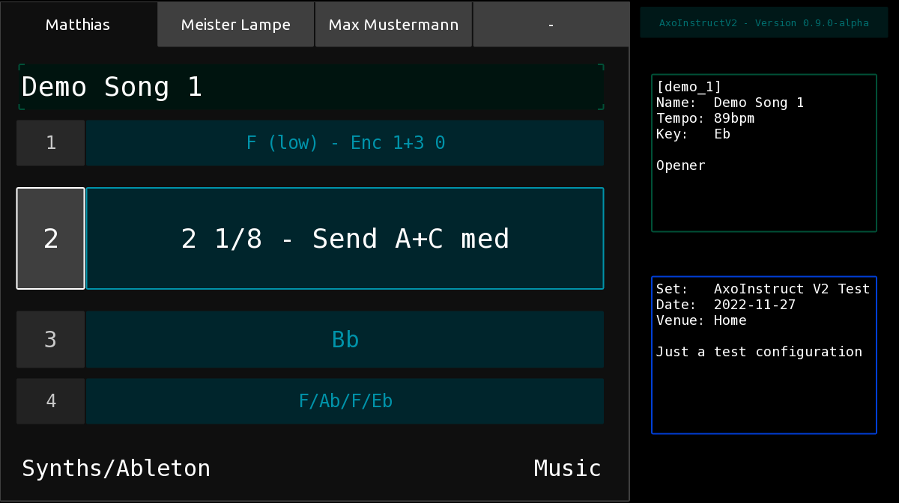
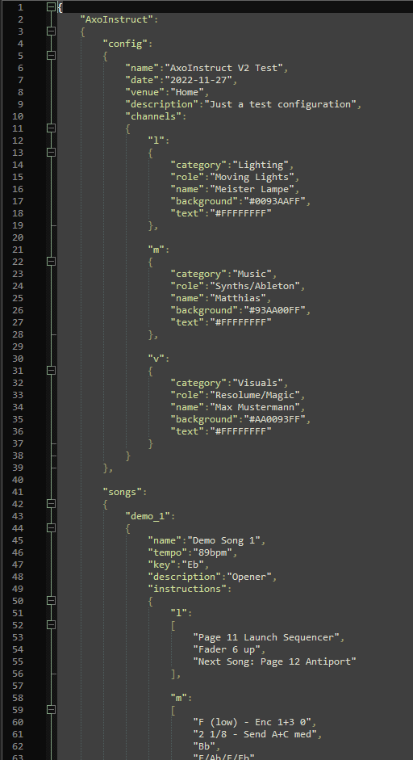
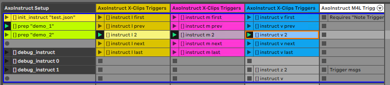

# AxoInstructV2
Flexible multi-user cue lists and stage instructions with Ableton Live, ClyphX Pro and TouchOSC Mk2. \
It provides and extended feature set compared to the original version, can be easily configured via JSON files and makes use of TouchOSC MK2's scripting capabilities on a variety of platforms.



# Setup and installation
## Downloads and required tools
* Download or clone this repository
* Have Ableton Live 11 (earlier versions have not been tested yet) and ClyphX Pro V1.3.0 (or later) installed
* On your computer or mobile device, have TouchOSC Mk2 installed (tested with version 1.1.7)


## Files and Folders
You need to create a couple of directories, copy a few files, and modify some settings

#### Folder `AxoInstruct`
Copy this directory and its files to the Documents folder in your home directory.
Examples: ```c:\Users\YOURNAME\Documents``` on Windows or ```/home/YOURNAME/Documents``` on Mac.
It contains the TouchOSC template for TouchOSC Mk2, an Ableton Live 11 Demo set and example JSON configuration as a starting point.

#### File `Preferences.txt` in Folder `nativeKontrol/ClyphX_Pro/`
This is my Preferences.txt file as reference. Make sure that yours contains both incoming and outgoing port definitions.
You also need to specify the IP address of the device running TouchOSC. Alternatively, you can use the broadcast address of your LAN to send OSC messages to all devices in that network.
Please note that the broadcast address in your network might be different to the one in this example. Please check your subnet mask: If the subnet mask is 255.255.255.0 you want to change the last tuple if your IP address to 255, everything else stays unchanged.

```
# This setting determines the OSC port number that ClyphX Pro will receive OSC messages from.
# The possible settings are any OSC port number.
INCOMING_OSC_PORT = 7005
OUTGOING_OSC_PORT = 7006
OSC_DEVICE_IP_ADDRESS = 192.168.0.255
```

### Folder `Remote Scripts`
Copy this directory and its content to the `Ableton/User Library` directory in your Documents folder.
Examples: ```c:\Users\YOURNAME\Documents\Ableton\User Library``` on Windows or ```/home/YOURNAME/Documents/Ableton/User Library``` on Mac.
It contains the ClyphX Pro User Action script for AxoInstructV2 and a fallback JSON file.

# Prepare your set configuration
Screenshot from example JSON file


# Setup your Ableton Live set and control your songs, cues and instructions
Screenshot from Demo Live Set

